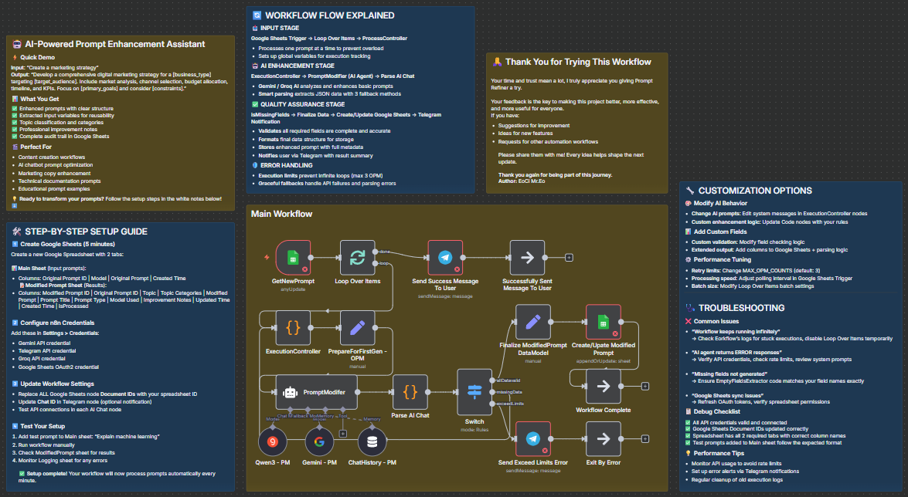

# 🤖 AI-Powered Prompt Enhancement Assistant


**AI-Powered Prompt Enhancement Assistant** is an n8n workflow that takes a simple user prompt and transforms it into a detailed, professional-grade AI prompt.  
It uses Google Gemini and Groq for multi-stage refinement, adds context, extracts metadata, and saves results into Google Sheets — ready for any AI-powered tool or automation.

---

## 📷 Workflow Preview

## 

---

## 📌 How It Works

1. You add a short prompt to the **OriginalPrompts** Google Sheet.
2. The workflow triggers and:
   - Enhances the prompt through Google Gemini and Groq.
   - Extracts structured data (modified prompt, title, topic, categories, prompt type, improvement notes).
   - Validates the output and retries if needed.
3. Stores the final result in the **ModifiedPrompts** sheet.
4. (Optional) Sends you a Telegram notification with a preview.

This automation removes the guesswork from prompt engineering, ensuring consistency and high-quality results.

---

## ⚡ Features

- **Automatic Prompt Refinement** — Turn a single sentence into a structured, ready-to-use AI prompt.
- **Metadata Extraction** — Topic, categories, type, and improvement notes included.
- **Retry & Validation** — Ensures all required fields are complete.
- **Google Sheets Integration** — Easy data management.
- **Optional Telegram Alerts** — Instant result notifications.

---

## 🛠️ Requirements

- [n8n](https://n8n.io/) (self-hosted or cloud)
- Google account with Sheets access
- API credentials for:
  - Google Gemini
  - Groq
  - (Optional) Telegram Bot

---

## 🚀 Setup Instructions

Setup time: ~5 minutes

1. **Create a Google Spreadsheet** with two tabs:

   - **OriginalPrompts** (columns example):  
     `Original Prompt ID | Model | Original Prompt | Created Time`
   - **ModifiedPrompts** (columns example):  
     `Modified Prompt ID | Original Prompt ID | Topic | Topic Categories | Modified Prompt | Prompt Title | Prompt Type | Model Used | Improvement Notes | Updated Time | Created Time | isProcessed`

2. **Import Workflow**

   - Download `pr_template_v1.0.json` from this repo.
   - In n8n: `Workflows → Import → Choose file`.

3. **Add Credentials in n8n**

   - **Google Sheets OAuth2**
   - **Gemini** API key
   - **Groq** API key
   - **Telegram** credential (optional)

4. **Edit Google Sheets Nodes**

   - Replace `documentId` with your Spreadsheet ID.
   - Replace `gid` values with your sheet GIDs.

5. **Activate & Test**
   - Save workflow and activate it.
   - Add a test row to **OriginalPrompts**:
     ```
     Original Prompt ID: 1
     Original Prompt: "Write a short blog post about AI ethics"
     ```
   - Wait 30–60s, then check **RefinedPrompts** for the result.

---

## 🎨 Customization

- **Change Output Tone** — Edit system prompts inside AI nodes.
- **Add More Models** — Connect extra LLM APIs.
- **Integrate with Other Tools** — Send results to Slack, email, or databases.

---

## 📂 Project Structure

```
PromptRefiner/
├── ai-powered-prompt-enhancement-assistant_v1.1.json # Main n8n workflow export
├── README.md # Project documentation
└── assets/ # (Optional) Diagrams, screenshots
```

---

## 🤝 Contributing

1. Fork this repository.
2. Create a new branch: `feature/my-improvement`.
3. Make your changes.
4. Submit a pull request.

---

## 📜 License

This project is proprietary and intended solely for **EoCi Solution**.  
All rights reserved.
